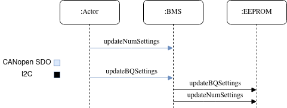
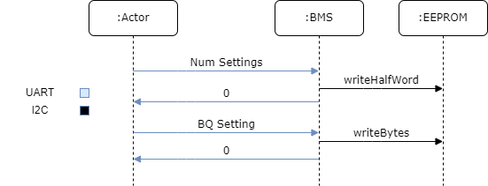

==========================================
BQ Settings Convert and Transfer Utilities
==========================================

Introduction
============

The BMS needs the ability to store settings and to transfer them to the BQ chip
(battery management IC on the BMS). Those settings are stored in the BMS's
on-board EEPROM and are loaded onto the BQ chip at system startup. The BMS
itself, however, needs a way to get the settings in the first place. Therefore,
included in this codebase are utilities for converting BQ settings into a
format that can then be transferred to the BMS as well as a utility for sending
those settings over to the BMS. The intention is to provide a replicatable
process for taking in new settings and updating the BMS.

Background
==========

The BQ chip is a TI product with the ability to operate under a wide range
of applications. As such, the BQ chip is highly configurable. The majority
of the settings are stored in the BQ chip "RAM" or "Data Memory", however the
BMS software was designed to also support configuration through commands and
subcommands. Each time the system starts up, the BQ chip must have all of its
settings sent over. The BMS handles the logic of transferring the settings to
the BQ chip, but it still needs to be sent of the settings at least once to be
stored in non-volatile memory (EEPROM). In order to accomplish this, the
settings for the BQ chip must be converted into a form that can then be sent
over CANopen to the BMS as well as be saved into EEPROM. The format of
the data is described in `BQ Setting Representation <https://dev1-bms.readthedocs.io/en/latest/BQ/settings_transfer.html#bq-setting-representation>`_.

The general flow of how the settings are transferred to the BMS is shown in the
diagrams below.

CANopen
-------

UART
----

The settings originally are stored in a file generated by `bqStudio <https://www.ti.com/tool/BQSTUDIO>`_,
a TI application. This document goes over the utilities that exist for converting
those settings into the format recognized by the BMS, and how to transfer those
settings to the BMS.

Human Process Description
=========================

Users of these utilities will be converting the TI settings file into the
BMS-recognized format. From there, additional instruction will be provided on
how the user can transfer those settings to the BMS itself. The TI settings file
contains the settings that will be applied to the RAM of the BQ chip.
Additionally, the settings file itself contains information on each setting,
including the type of data, the units, the size in bytes, and how to convert
from a human readable format into the BQ expected format.

The user of the utility does not have to know the intricacies of the
TI settings file but should be aware of its function. Further information on
how to generate the TI settings file can be found in Section 3 of the
`Easy Configuration of BQ76942, BQ76952 Battery Monitors <https://www.ti.com/lit/an/slua991a/slua991a.pdf?ts=1638132333882&ref_url=https%253A%252F%252Fwww.ti.com%252Fproduct%252FBQ76952>`_ document.
Additionally, documentation on the settings themselves and how they apply
can be found in Section 13.1 of the `BQ76952 Technical Reference Manual <https://www.ti.com/lit/ug/sluuby2a/sluuby2a.pdf?ts=1638144629385&ref_url=https%253A%252F%252Fwww.ti.com%252Fproduct%252FBQ76952>`_.
The selection of the settings values themselves is beyond the scope of this
document, but again, understanding the origin of the data can prove useful.

The utilities themselves are Python3 scripts with a command line interface.
Users will interact directly with the scripts in order to execute the
conversion logic as well as the transfer logic. The remainder of this
document will go over the specifics of interacting with these scripts.

Training Module
===============

Target Population
-----------------

Users of the utility are expected to have some level of confidence running
Python scripts and using command line tools. The utilities conform to standard
practices and leverage the package "argparse" so users with a background in
command line usage should be able to use the utilities with ease.

With those considerations in mind, users of this code are expected to be
either firmware members working with an electrical engineer team member, or
an electrical engineer team member who is comfortable working at the command
line.

Objective
---------

The goal of this manual is to give users the knowledge necessary to convert
TI settings into a binary format which can then be transferred to the BMS.
This will focus on the scripts included in the utility. Focus will not be
on the format of the data, the meaning behind the settings, nor on the
specifics of the implementation. For more of the specifics on the BQ
chip, refer to `the corresponding documentation <https://dev1-bms.readthedocs.io/en/latest/BQ/index.html>`_.

Criteria
--------

The only criteria for executing this script is that the settings are verified
to be the correct ones to send to the BMS. This should be done by a lead
electrical engineer for the BMS project. Failure to apply the correct settings
could lead to damage of the BMS or the battery it is used with.

Task Listing
------------

1. Using the provided convert utility to convert the settings from TI to binary
2. Using the transfer utility to send the settings out over CAN
3. Using the convert utility to convert TI settings into an
   intermediate CSV format.
4. Using the convert_transfer utility to convert the setting from TI to binary
   and send out over a serial connection in one step.

Module
------

Getting Started
~~~~~~~~~~~~~~~

First users will need to install the required Python packages in order
to execute the utilities. It is assumed that the user has Python3 already
installed on their system.

To install the additional Python packages, navigate to `tools/bqsettings`
and run the command below. Note, it is recommend to use a Python virtual
environment or similar to keep environments clean.

.. code-block:: bash

   pip install -r requirements.txt

From here, users should be able to execute the utilities. Users can verify
this by executing the command below.

.. code-block:: bash

   python run.py --help

Converting to Binary
~~~~~~~~~~~~~~~~~~~~

Conversion to binary is executed with the ``convert`` command passed to the
``run.py`` script. To see the options available, users can pass the "help"
flag resulting in the output below.

.. code-block:: bash

   $ python run.py convert --help

   usage: run.py convert [-h] [--target {binary,csv}] input output

   positional arguments:
       input                 The file that is going to be converted into either binary or
                            the intermediate CSV format. This can either be the TI provided
                            file, or the intermediate CSV format itself.
       output                The destination to save either the binary format or the CSV
                            data

     optional arguments:
       -h, --help            show this help message and exit
       --target {binary,csv}
                            The target format, either binary or CSV, defaults to binary

To convert a file from the TI format to binary, the command below can be
used as an example.

.. code-block:: bash

   python run.py convert default.gg.csv output.bin

Note the file extension on the input. TI files have the extension ``.gg.csv``
which must be maintained for the script to execute properly. After executing
the script, a file ``output.bin`` should be produced with the contents being
the binary representation of the data.

Transferring the Settings over CAN
~~~~~~~~~~~~~~~~~~~~~~~~~~~~~~~~~~

Transferring the settings can take place via any method that allows sending
binary data over the CANopen network. The approach detailed below utilizes the
provided Arduino code to have an Arduino facilitate sending the data over the
CANopen network. Users can also utilize tools such as VectorCAN to send the
settings over. In the case of using another tool, users must first make an
SDO request to the BMS updating the number of settings before sending the
settings themselves over in a segmented SDO (which VectorCAN supports via the
binary file produced by the conversion script executed above). Note, the
use of third party tools is beyond the scope of this manual, but their
existence is noteworthy.

First, users need to flash the Arduino code to an Arduino device with a
compatible CAN shield. The code is located in ``tools/bqsettings/arduinoTransfer``.
Resources for programming an Arduino are available online.

The help output for the transfer command is shown below.

.. code-block:: bash

   $ python run.py transfer --help

   usage: run.py transfer [-h] input port

   positional arguments:
       input       The binary file containing the settings to transfer
       port        Port of the Arduino to send settings to

   optional arguments:
       -h, --help  show this help message and exit

When transferring the settings, the user must provide the binary file of
settings and the port of the Arduino. Below is an example usage of the script.

.. code-block:: bash

   python run.py transfer output.bin /dev/ttyUSB0

Users can determine which port to use for the Arduino using the Arduino IDE.

Converting to Intermediate CSV
~~~~~~~~~~~~~~~~~~~~~~~~~~~~~~

Users also have the ability to convert the TI settings into an intermediate
CSV format, then convert the intermediate CSV format into binary. This gives
users the opportunity to insert additional settings into the CSV before
converting the settings into binary. Below is an example execution of the script
to convert the data to CSV.

.. code-block:: bash

   python run.py convert default.gg.csv output.csv --target=csv

At this point, the user can add settings to the ``output.csv`` then run the
command below to convert the CSV into binary.

.. code-block:: bash

   python run.py convert output.csv output.bin

Converting and Transferring over UART
~~~~~~~~~~~~~~~~~~~~~~~~~~~~~~~~~~~~~

With revision 3 of the BMS, UART was exposed, so we were able to start using
that interface for transferring settings instead of CAN. Because UART is a
simpler method of communication, this is generally the preferred method of
transferring settings to the BMS.

To get started, all you'll need is a BMS, a BMS battery power source, an
STLink-v3 Mini, and your laptop. Connect the STLink to your computer and the
BMS, and carefully plug the BMS in. In STM32CubeProgrammer, confirm that you are
able to connect to the microcontroller. Next, confirm that you have the Python
scripts ready by get the help message for the ``convert_transfer`` command.
Below is some example output.

.. code-block:: bash

    $ python run.py convert_transfer --help

    usage: run.py convert_transfer [-h] input port

    positional arguments:
      input       The TI file containing the settings to transfer
      port        Serial port connected to the BMS

    optional arguments:
      -h, --help  show this help message and exit

Once this is working, you can begin the transfer process by following these
steps:

1. Open a command prompt and navigate to ``BMS/tools/bqsettings``.
2. Compile and flash ``uart_settings_upload`` to the BMS.
3. Within 10 seconds, run ``
   a. This 10-second time limit is caused by a limitation of EVT-core. It should
   be fixed in future development.
4. Wait for all settings to be sent to the BMS and written to the EEPROM.

To confirm that settings have been sent successfully and that they don't cause
issues with the BQ chip, perform the following steps:

1. Compile and flash bq_interface to the BMS.
2. Confirm that you have communication with BQ chip ('v').
3. Transfer settings from the EEPROM to the BQ chip ('t').
4. Check if you have communication with the BQ chip ('v').

References
~~~~~~~~~~

* `BQ76952 3-s to 16-s high-accuracy battery monitor and protector for Li-ion, Li-polymer and LiFePO4 <https://www.ti.com/product/BQ76952>`_
* `CANopen - The standardized embedded network <https://www.can-cia.org/canopen/>`_
* `EVT-core <https://evt-core.readthedocs.io/en/latest/>`_
