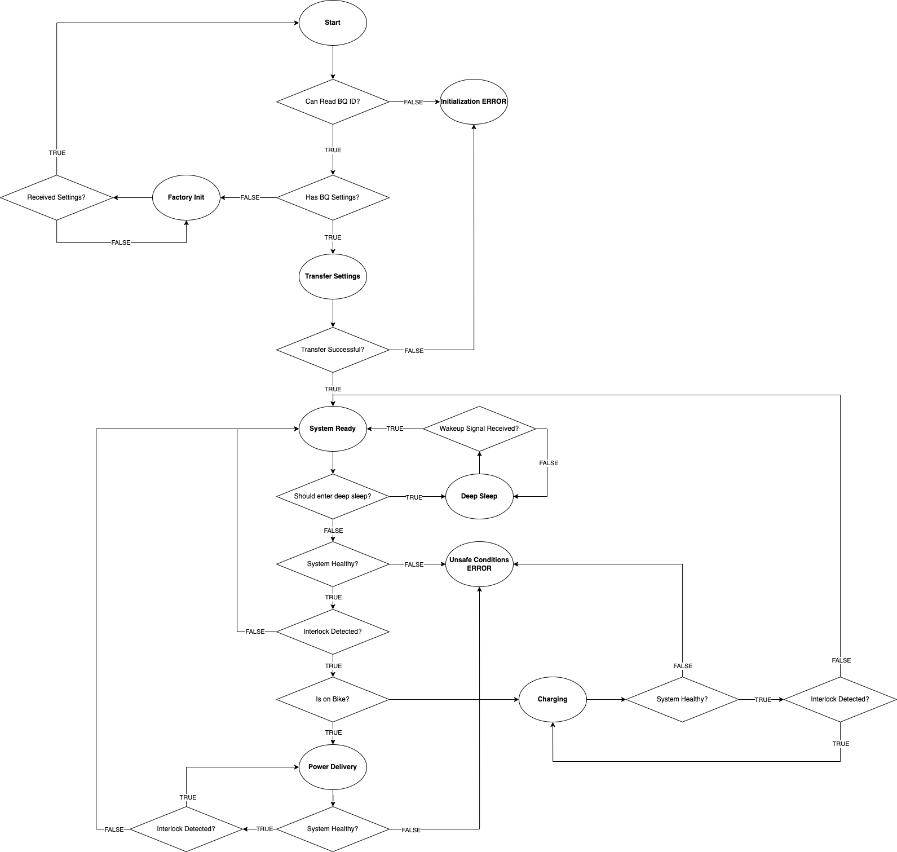

.. Documentation master file, created by
   sphinx-quickstart on Sat Sep  4 10:17:15 2021.
   You can adapt this file completely to your liking, but it should at least
   contain the root `toctree` directive.

===============================
Welcome to BMS's documentation!
===============================

Introduction
============

The DEV1-BMS is the Battery Management System for the RIT-EVT Dirt
Electric Vehicle (DEV1). The system is based around the BQ76952 TI battery
monitor and protector chip. The firmware for the DEV1-BMS is written for
the STM32f302r8 microcontroller that is designed into the DEV1-BMS.

The DEV1-BMS will have the following responsibilities.

1. Run safety checks during DEV1 operation
2. Facilitate battery charging
3. Act as an interface to the on-board BQ76952
4. Expose the system over the DEV1 CAN network

For a more detailed description of the requirements, refer to the
`DEV1-BMS Software Requirements Specification <https://dev1-bms.readthedocs.io/en/latest/srs.html>`_

The DEV1-BMS project is in its rampup phase. Currently documentation is being
generated for the project including requirements and implementation design.

.. toctree::
   :maxdepth: 2
   :caption: Contents:

   api/index.rst
   srs.rst
   BQ/index.rst

State Transition Diagram
------------------------
For a look at each stage of the BMS firmware in action. The state diagram
below can be used.

The functionality of the BMS can be broken down into 4 major components.
The "Startup" logic which involves getting the settings for the BQ chip
and transferring those setting from a seperate host via CANopen, to EEPROM,
and finally to the BQ chip itself. The "Ready" state which is where the BMS
spends the bulk of its time, checking on the health of the BMS system, and
waiting for the system to either charge or discharge. The "Charging" state
where the BMS mediates charging the batteries. Finally the "Power Delivery"
state where the BMS is handling delivering power. The logic for flowing
between the different states is detailed in the diagram above.

EVT-core
========

EVT-core is the RIT-EVT produced library for interfacing with the STM32f302r8
that will be on the DEV1-BMS. For more information on that library, visit
`RTD for EVT-core <https://evt-core.readthedocs.io/en/latest/>`_

Indices and tables
==================

* :ref:`genindex`
* :ref:`modindex`
* :ref:`search`
