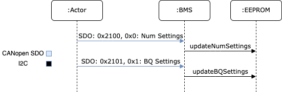
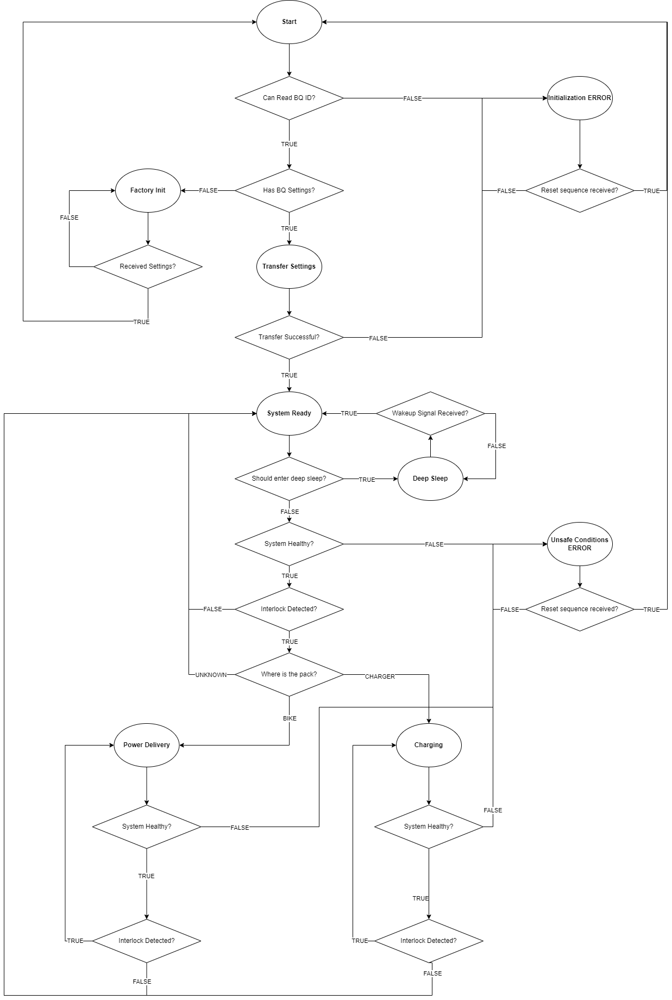

=========================
State of the BMS Software
=========================

Development of the BMS software, including capturing of software system
specifications, software architecture and design, implementation, and
initial validation was performed by Collin Bolles. Further validation and
integration into the overall DEV1 system was performed by Matt Magee. This
document details the state of the software as of 1/15/2024 and is intended as a
reference for the next developer to take up the BMS project. The remainder of
the document will go over the current software architecture, important
implementation details, notable pitfalls, and what remains of the project.

Introduction
============

As stated elsewhere in the BMS documentation. The BMS system is built around
the BQ76952 which is a battery management chip created by TI. Much of the
software architecture is designed around the functionality of the BQ chip, and
thus, an understanding of the chip is necessary to understand the implementation
details of the software. Documentation for the BQ76952 can be found
`on TI's website <https://www.ti.com/product/BQ76952>`_.

Other major components of the BMS to note are the STM32f334r8 microcontroller,
EEPROM non-volatile memory, thermistor multiplexor, and CAN transceiver. These
are the main components that the software interacts with and the usage of each
element is discussed in details further on.

The software is now in a state where MVP functionality has been implemented and
the vehicle has successfully run. Essential communication with the BQ has been
implemented, and configuration has been exposed over UART. BQ configuration may
be implemented over CANopen, but it has not been tested since Collin left. There
is support for detecting a number of errors, including overtemperature, under-
and over-voltage, and communication failures. However, there are still some
features that need to be implemented or cleaned up. The currently supported
features, summary of currently validated software, and the features still needed
to be added are detailed below.

High-Level Features
===================

A full indepth description of the system requirements are detailed in the
Software Requirement Specification (SRS) which can be found
`here <https://dev1-bms.readthedocs.io/en/latest/srs.html>`_. Some of the key
details are listed below as they have the biggest impact on the software.

* Transfer and storage of BQ settings
* Broadcast of battery pack data over CANopen
* Control of BMS OK signal

These key requirements dictate how the software is designed and constrained.
An overview of each and how the software as impacted based on the requirements
are included below.

Transfer and Storage of BQ Settings
-----------------------------------

The BQ chip is designed to be used in a wide range of battery systems and, as
such, has a lot of settings which control the behavior of the chip. In total,
there are about 274 settings which control everything from information on the
battery pack itself, to fault handling cases, to communication protocol
settings. These settings are set mostly by the Electrical team as they have the
most relevant domain knowledge.

BQ Settings Overview
^^^^^^^^^^^^^^^^^^^^

The BQ supports two main ways of getting the settings into the BQ's memory.
The first approach is through a method called OTP (one time programming)
where the BQ is placed in a special state and the settings are written into
non-volatile memory. The issue which this approach, as the name suggests,
this can only be done once. As the documentation states "once a bit is set to
a 1, it cannot be set back to a 0". As we have a need to tweak settings as we
learn more and make changed to the system we cannot rely on OTP.

The second approach, and the method we use, is to transfer the settings to the
BQ on system startup. Each setting can be written to the BQ via I2C commands
so when the system starts up, the microcontroller writes each setting to the BQ.
The benefit of this approach is that we can change the settings as need be, but
the downside is the need to store all the settings and transfer them to the BQ
each time the system starts up. This means that the settings have to be stored
in some non-volatile memory, and that the BMS system needs some method to allow
for the settings to be transferred from some host system to the memory.

Transfer of Settings to BMS System
^^^^^^^^^^^^^^^^^^^^^^^^^^^^^^^^^^

**NOTE: This has not been tested in some time and is not recommended as a first
attempt for transferring settings. For more recently tested instructions, skip
to "One-Step Settings Transfer over UART"**

There needs to be an approach to get the settings transferred from some host
to the BMS system. This is handled via CANopen which allows for transfer of
larger portions of data via a method called "block transfer". The code for
handling the transfer logic can be found in ``BQSettingStorage``.

The ``BQSettingStorage`` class handles the logic of exposing the setting
transfer and storage logic. It has two main responsibilities. First, the
class contains the logic of exposing a means to transfer the settings from the
host to the BMS system over CANopen. Second, the class handles reading and
writing those settings between non-volatle memory (EEPROM) to the BQ chip
itself. The transfer of the settings take place across two steps. First
the external host writes the new number of settings to the BMS system over
CANopen. Second, the external host then writes out each setting over
CANopen. The ``BQSettingStorage`` handles the whole process of updating the
number of settings and getting the settings themselves into EEPROM. Below is a
small sequence diagram showing what takes place to allow the settings to be
transferred.

The exposure of these settings is handled via CANopen stack, so for a more
indepth understanding of how to implement custom settings you can refer
to `CANopen stack's documentation <https://canopen-stack.org/v4.4/>`_.

Converting BQStudio Settings to Binary
^^^^^^^^^^^^^^^^^^^^^^^^^^^^^^^^^^^^^^

The BQ settings are usually set using a TI provided software, BQStudio, and then
exported to a CSV format. The CSV format stores a number of pieces of
information including the location in the BQ where the setting should be
stored, how many bytes the setting takes up, a human readable representation
of the data, and an equation to convert the human readable format into
what can actually be stored in the BQ. These settings needs to be converted
from the CSV into a binary file which can then be transferred over CANopen.
For more information on how the data is packed into a binary format,
refer to the `settings transfer documentation <https://dev1-bms.readthedocs.io/en/latest/BQ/settings_transfer.html>`_.
The backed format in that document is how the settings are stored both for
transfer over CANopen and for storage in EEPROM.

A python script is provided which handles the logic of converting the CSV
into a binary format and another script exists for the logic to transfer
the binary file over CANopen. Documentation for how to use those scripts are
included with the scripts. Luckily the process of sending a binary file over
CANopen is a standard practice, so the binary file can be transferred with
any tool capable of CANopen including a Vector CAN adapter.

The scripts to convert the CSV and transfer the CSV over CANopen can be found
in ``tools/bqsettings/``. The usage of the scripts are further explained there.

One-Step Settings Transfer over UART
^^^^^^^^^^^^^^^^^^^^^^^^^^^^^^^^^^^^

After Collin left, there was some confusion about the reliability of the CANopen
settings transfer, so most settings transfers were instead done over UART,
exposed on the new 14-pin JTAG connector on the PCB. There is a target, called
"uart_settings_upload" and corresponding Python function in ``convert.py``
called ``ti_to_uart()`` which can be used together to upload settings to the
EEPROM over UART. More detail can be found in the
`settings transfer documentation <https://dev1-bms.readthedocs.io/en/latest/BQ/settings_transfer.html>`_.

Transfer of Settings to BQ
^^^^^^^^^^^^^^^^^^^^^^^^^^

When the BMS system starts up, the microcontroller reads the number of settings
from EEPROM and transfers that number of settings from EEPROM to the BQ over
I2C. These settings are transferred one-by-one until all have been sent across.
This takes place over a 30-45 second period.

Broadcast of Battery Pack data Over CANopen
-------------------------------------------

The battery pack information is exposed over CANopen via timer-based TPDOs.
Most of the data is polled from the BQ over I2C at some interval and a pointer
to that data is included in the CANopen object dictionary. This sharing of data
is very standard and does not have BMS specific logic. The currently supported
data which is exposed is listed below.

* Total battery pack voltage
* Total battery pack current
* Individual cell voltages
* Temperatures at various points in the pack and on the BMS PCB
* Current state of the BMS (based on the BMS state machine)
* Information on the state of cell balancing

Some information which is not yet exposed but should be is listed below.

* Temperature readings
* Number of BQ settings stored
* Ability to read back stored BQ settings
* Misc BQ status

Control of BMS OK Signal
------------------------

The BMS indicates whether it is safe to charge/discharge with a status pin
called the OK signal. In the initial hardware implementation, this was tied to
an output of the BQ chip, but it was later revised to come from the
microcontroller instead. This 3.3V output is routed to an optocoupler, which
electrically isolates the BMS from external systems.

System State Machine
====================

The software is designed around the requirements expressed above. The whole
system is implemented explicitly as a state machine which reflects the
actions taking place in the BMS system. The state machine is listed below.
Additional details regarding implementation will follow.

The first part of the state machine from "Transfer Successful" and above
reflects the settings transfer logic. The "Factory Init" state represents
when the BMS system is waiting for settings from a host and the
"Transfer Settings" state represents when the STM is actively reading settings
from EEPROM and sending those settings over to the BQ.

The remainder of the state machine represents the normal sequence of states
that takes place when the system is powered on. The system makes health
checks and determines what the battery pack is connected to to determine what
functionality takes place.

The STM determines what that battery pack is connected to by watching for
specific CANopen heartbeats. The ``SystemDetect`` class handles this by
processing incoming heart beats and determining the origin of the heart beat.
If the heart beat matches the PVC, the system the battery pack
is connected to is identified as the motorcycle. Alternatively, if the heart
beat is found to be the Charge Controller, the system is identified as
being the charger. Additionally, a timeout is in place to represent if no
known system is detected if a heat beat is not received within a specific
timeout.

Health checks also take place throughout the state machine. These health checks
consist of reading the state of the BQ alarm pin, detecting communication
errors, and checking for high pack temperatures.

The interlock is another major factor in controlling the flow of the
state machine. The interlock is used to identify when the battery pack is
actually plugged into something. This is handled via a GPIO to the STM.

The last major thing to note in the state machine is the way errors are handled.
If the BMS enters one of its error states, it will stay there until it is sent a
particular sequence of CAN messages. This behavior is handled by the
``ResetHandler`` class.

Code Breakdown
==============

This section is dedicated to explaining the purpose of each class in the
codebase. The goal being that a reader will be able to understand the purpose,
and where to go to look for specific functionality.

Source Files
-----------

BMS
^^^

The BMS class is the top-level class which represents the board itself. Its main
purpose is to contain the CANopen object dictionary and handle the logic of
the state machine. Contained in the class is the object dictionary itself,
and the logic which is executed within each state, including the logic for
handling state transitions. These functions reach out to the other components of
the BMS.

BMSInfo
^^^^^^^
This file holds a few structs used to package related data together. This
ensures BMS function calls don't have a ridiculous number of parameters.

BQSetting
^^^^^^^^^

This class represents a single BQ setting. It has getters and setters to
represent each aspect of a BQ setting such as the address, setting type,
number of bytes, and the data itself. The BQ setting also has the ability to
encode and decode settings from the binary format documented above. This is
used as the means of representing a setting in the BMS system and as such is
used heavily by the ``BQ76952`` class and the ``BQSettingStorage`` class.

BQSettingStorage
^^^^^^^^^^^^^^^^

The ``BQSettingStorage`` class handles the transfer and storage of BQ settings.
This class handles the transfer of settings from a host to the BMS system via
CANopen, handles saving the settings into EEPROM, and handles sending settings
from EEPROM to the BQ itself.

ResetHandler
^^^^^^^^^^^^

This class handles detecting the reset sequence of CAN messages. It reads in
all processed CAN messages and can be polled to see if the reset signal has been
received.

SystemDetect
^^^^^^^^^^^^

The ``SystemDetect`` class handles the logic of determining what the BMS is
connected to. This differentiates between the CANopen heartbeat of the PVC and
Charge Controller.

dev/BQ76952
^^^^^^^^^^^

This is the representation of the BQ chip itself. Contained is a series of
functions which expose the functionality of the chip itself. This includes
features such as saving a setting, reading voltage, balancing cells, etc.
As more features of the BQ chip are supported, this class will grow the most.

dev/Interlock
^^^^^^^^^^^^^

The ``Interlock`` class is a representation of the interlock and is really just
a thin wrapper around a GPIO which adds some semantics in the interlock usage.

dev/ThermistorMux
^^^^^^^^^^^^^^^^^

This class represents the multiplexor connected to the pack's thermistors. It
handles operating the multiplexor and reading temperatures from the thermistors.

Targets
-------

bms_canopen
^^^^^^^^^^^

This is a test target to validate that all the data in the BMS class is being
exposed on the CAN network properly. It utilizes a function in the BMS class
``canTest()`` which just sets all the variables to values that make it easy to
tell whether they're in the right places.

bq_interface
^^^^^^^^^^^^

This is a UART utility that adds the ability to interface with the BQ via
the microcontroller in a command-line environment. The user has a menu which
they can use to read/write settings, poll voltage, and even enable and disable
balancing of cells. This is a great tool for debugging issues with the BQ.

bq_settings
^^^^^^^^^^^

This is a test target for the settings themselves. It is used for verifying
that the settings can be encoded and decoded into their binary format
correctly.

DEV1-BMS
^^^^^^^^

This is the main target and the one that sets up the state machine and full
exposure of information over CANopen. This is what is flashed to boards used on
the vehicle.

eeprom_dump
^^^^^^^^^^^

As the name suggests, this utility is for looking at the contents of EEPROM.
All of the settings are read from EEPROM and printed one-by-one.

reset_handler
^^^^^^^^^^^^^

This is a simple test target to validate the ``ResetHandler``. It just prints
whenever the class detects the reset sequence.

setting_transfer
^^^^^^^^^^^^^^^^

This target is used specifically for testing the settings transfer from
EEPROM to the BQ. This is useful when testing to make sure each setting is
transferred as expected.

system_detect
^^^^^^^^^^^^^

This utility is used for testing the ability of the BMS system to identify
what external system it is connected to

thermistor_mux
^^^^^^^^^^^^^^

This is a test target for the ``ThermistorMux`` class. It tests reading
temperatures from all eight possible mux inputs.

uart_settings_upload
^^^^^^^^^^^^^^^^^^^^

This target is used with the ``ti_to_uart()`` function in ``convert.py`` to
upload settings from a TI CSV file to the EEPROM over UART.

Current State of Features
=========================

Transfer of Settings
--------------------

The ability to transfer settings is nearly complete. The last functionality
we'll need for testing is polling the current settings from the BQ.

Currently the whole process for transferring the settings, storing the settings
in EEPROM, and sending the settings to the BQ is supported. This is all
that is required assuming the settings are converted to a binary format
correctly and that the settings provided in the CSV format are correct.

However, for additional testing both for software and hardware, there is
a need for the ability to read back the settings and potentially write
individual settings when the system is run. Preliminary discussion on
implementation has taken place and has boiled down to two main aspects.

First, the ability to poll arbitrary settings over CANopen. This would involve
allowing a host to poll BQ settings using CANopen requesting a set number of
bytes from a address in the BQ. The second aspect would be a corresponding
python script which would be capable of reading back all of the BQ settings
corresponding to the TI CSV to verify that the settings match what was expected.

This is no small undertaking, but the infrastructure exists with the ability
to represent setting using the ``BQSetting`` class and the ability access
certain pieces of data over CANopen already implemented.

BMS OK Status
-------------

As of now, the BMS OK signal has fully implemented all planned features. It
accurately represents the status of the BMS, so we'll only need to worry about
debugging possible issues for now.

Exposure of Data
----------------

All data we had planned to expose has been exposed over CANopen. To see what
this data is, you can look either at the object dictionary in ``BMS.hpp`` or at
the EDS files in the `CAN-Tools repository <https://github.com/RIT-EVT/CAN-Tools>`_
on GitHub.

Deep Sleep
----------

A deep sleep mode needs to be added to the BMS. The BMS system is intended to
essentially be always powered on since the BMS is powered by the battery pack
itself. As such, during periods of battery storage, the system should enter
some deep sleep mode to not draw too much power. The intention would be that
the system makes use of an ST specific deep sleep mode and awakes under some
IO condition. This could be through a GPIO wakeup which as the interlock
detection, or potentially a wake up over CAN setup.
