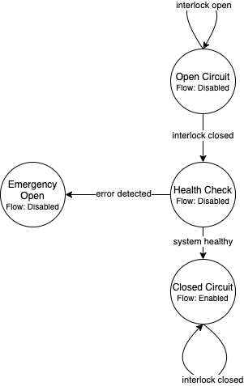

======================================================================
Software Requirements Specification for DEV1 Battery Management System
======================================================================

Introduction
============

Purpose
-------

The purpose of this document is to detail the software requirements and
constraints for the firmware of the Dirt Electric Vehicle Battery Management
System (DEV1 BMS). This document will go into detail on the requirements
necessary for the system as well as detailing the contrains that the system
will be under. The intention is that this document will provide a means to
holistically express the needs to the DEV1 BMS system.

Document Conventions
--------------------

This document was created based on the IEEE template for software requirements
specifications. As such it will mainly adhere to the verbage and style
set by IEEE convention. Additonally, a glossary has been provided in the
Appendix which covers common phrases that will be used in this document.

Intended Audience and Reading Suggestions
-----------------------------------------

The intention is that this document will be accessible across engineering
disiplines. The DEV1 BMS represents a highly inter-disiplinary project
on the RIT Electric Vehicle Team and as such this document should be
accessible to all involved. Below is a break down of the intended audiences
and how they may use the document. This list is not exhaustive, but intended
to guide common readers of this document.

* Electrical Team Members: Members of the electrical team who are designing
  and building the DEV1 BMS. Members of this group may refer to this document
  to ensure requirements and constraints align with their expectations.
  Additionally, this document can be used as a point of reference during
  the hardware/firmware bring up and debugging.
* Firmware Team Members: Developers on the firmware team who are designing,
  developing, and testing the DEV1 BMS firmware. Members of this team will
  need to refer to this document throughout the development process to ensure
  all target needs are met within the agreed upon contraints.
* Integration Team Members: RIT EVT team members who handle systems level
  integration on the team. These team members may use this document to gain
  and understanding of how the DEV1 BMS will operate. Most critically, how the
  DEV1 BMS will operate within the structure of the DEV1 architecture.

The document is layed out where it is not strictly necessary to read all
sections in their entirety. Instead each section should be self-contained
and self-entirety within its scope. As such audience members are encouraged
to read the sections that most pertain to their needs. Additionally, the
glossary in the Appendix may prove useful in situations where phrases may
be used in specific ways within this document.

Product Scope
-------------

The DEV1 BMS handles the battery management of the system. The DEV1 BMS will
interact directly with the twin battery packs that will be present in the
DEV1 architecture. As such, the DEV1 BMS scope will include battery pack
health and safety, sharing battery statistics on the DEV1 CAN network,
handling cell balancing, and providing a general interface to the battery
packs. A noteworthy exclusion to the scope is the power distribution logic
which will not be handled by the DEV1 BMS. The power distribution is not
in the scope of the DEV1 BMS and instead is handled by the DEV1 APM.

Safety
~~~~~~

The DEV1 BMS will handle safety critical functionality that relates to the
health of the battery pack. These range in levels from low priority to
safety critical events. Below are the features that fall under the scope
of the safety aspect of the DEV1 BMS.

* Control of the flow of current
* Notification of thermal issues
* Notification of cell voltage issues
* Notification of BQ76952 state
* Detection of battery connector

Diagnostics
~~~~~~~~~~~

The DEV1 BMS will be the main point-of-contact with the battery pack and
the cells contained and as such will have to have functionality to extract
information on the battery pack itself. Functionality that falls under this
scope is not safety critical and is intended to be used for data collection
and decision making during the usage of the motorcycle. This information
will be exposed on the CAN network and the DEV1 BMS will also expose means
of directly requesting data from the BQ76952 battery monitoring IC.

* Transmition of thermal state of battery pack
* Transmition of battery pack voltage
* Transmition of average cell voltage
* Transmition of standard deviation of cell voltage
* Exposure of BQ76952 chip

Charging
~~~~~~~~

The charging of the battery pack will have health checks that are managed by
the DEV1 BMS. After charging takes place, the DEV1 BMS will also oversee cell
balancing that will take place within the battery pack. As such, the following
features will need to be included.

* Performance of handshake with charge controller
* Reporting of health of battery pack
* Control of the flow of current

Overview
--------

The rest of this software design document will go further into the specifics
of the requirements while also looking at the constraints of the system. The
goal is to clarify the use cases of the DEV1 BMS and specifying what the DEV1
BMS will do in those use cases. Design considerations will not be discussed,
however notable design contraints will be covered.

Overall Description
===================

Product Perspective
-------------------

The DEV1 motorcycle will make use of custom battery packs which will provide
power to the entirety of the DEV1 architecture during normal operation.
The target event for the DEV1 motorcycle is a 24 hour endurance race. With
these considerations in mind, the DEV1 BMS is critical to the success and
safety of the DEV1 project. A critical component is the safety of the
battery cells within the battery packs. As such, the DEV1 BMS will need
to preform safety checks and handle the battery cell balancing logic.

The DEV1 BMS will be a board that will be present in each battery pack.
Each DEV1 BMS will operate independently and will handle the safety of
the individual pack. This includes both during normal operation when the pack
is on the motorcycle as well as when the pack is being charged.

The DEV1 BMS itself is made up of two major configurable components. The
ST micrcontroller which handles programmable logic and exposes the DEV1 BMS
on the CANopen network. As well as the BQ76952 battery monitor and protector
IC which handles the battery safety and monitoring logic.

User Interfaces
~~~~~~~~~~~~~~~

Users will rarely interact directly with the DEV1 BMS software. The DEV1 BMS
software will mainly be interfaced with via CANopen and thus will require
additional tools to interact with the DEV1 BMS. An external tool will be
needed to interact with the DEV1 BMS and will not be in the scope of the
DEV1 BMS software.

Hardware Interfaces
~~~~~~~~~~~~~~~~~~~

The DEV1 BMS will be exposed on the CANopen network which is made up of
a two-wire differential pair. The connector will be standardized and be
handled by the DEV1 system team. The software on the ST microcontroller
will be connected directly to the I2C lines of the BQ76952 chip.

Software Interfaces
~~~~~~~~~~~~~~~~~~~

The main software interface will be the expose of the BQ76952 chip over
the CAN network. The DEV1 BMS will need a software interface for acting as
a bridge between the external actor and the BQ76952 chip. The DEV1 BMS will
need to be flexible to expose all functionality of the BQ76952 so that the
BQ76952 can be configured.

Communication Interfaces
~~~~~~~~~~~~~~~~~~~~~~~~

The main communication interface for the DEV1 BMS will be CANopen. CANopen
is build ontop of the hardware and data layer specifications of CAN. The
majority of the CAN based network communication that will be used will
conform to CANopen including how the DEV1 BMS will expose information on
the DEV1 system network. The BQ76952 chip expose logic may or may not
conform to CANopen depending on the final implementation.

Communication between the ST microcontroller and the BQ7695 will be handled
via I2C. The BQ7695 contains the specifications of the I2C interface.

Memory Constraints
~~~~~~~~~~~~~~~~~~

The produced software is limited to the 64KB of flash memory that is
available on the STM32F302r8. Therefore the resulting binary must fit within
this size.

Operations
~~~~~~~~~~

The DEV1 BMS will operate in four main states during operation. The main
output from the states is the current flow control. When flow is enabled,
current is able to flow into and out of the battery, when flow is disabled,
current cannot flow. The interlock positioned on the battery connector
is what triggers the initial mode transition on system startup. The diagram
below follows the logic that will need to be implemented.

Note, when an critical error takes place, the system cannot directly
recover from the error. This is done intentially. The reasoning is that if
a critical error takes place with the battery pack the system should first
be manually inspected and probed for the issue. Then after the issue is
resolved, the system can be power cycled restarting the state machine logic.

Site Adaptation
~~~~~~~~~~~~~~~

The DEV1 BMS is intended specifically for the DEV1 system. Therefore, the
software requirements and design will center around the specifics of the DEV1
system. No addtional adaptations are currently being considered.

Product Functions
-----------------

Safety
~~~~~~

Control of the Flow of Current
^^^^^^^^^^^^^^^^^^^^^^^^^^^^^^

The DEV1 BMS will need the ability to control the ability flow of
current into and out of the battery pack. This will be a shutoff that will
stop the flow of charge that will be used both during normal operation and
during safety critical events. As such, the DEV1 BMS will need a programmable
means to control that flow so that the system can respond to a range of
stimuli. Below are listed out the situations that could cause the DEV1 BMS
to stop the flow of current.

* Thermal situtation where battery pack as passed a configurable threshold
  temperature
* Interlock does not detect the presence of a battery connector
* BQ76952 chip has detected one of many configurable safety critical events
  such as a thermal runaway event

Notification of Thermal Issues
^^^^^^^^^^^^^^^^^^^^^^^^^^^^^^

The DEV1 BMS will contain temperature sensing units. These units will be used
both for determining if a thermal safety critical event has taken place
as well as for notification to the greater DEV1 system of the current thermal
situation of the battery pack. This is intended for providing a means for
the DEV1 thermal management system to determine the amount of heat energy that
will need to be removed from the battery pack and to plan accordingly. The
notification process will take place via the CANopen network which will be
discussed in greater detail in the section "External Interface Requirements".

Notification of Cell Voltage Issues
^^^^^^^^^^^^^^^^^^^^^^^^^^^^^^^^^^^

The DEV1 battery pack will need to have constant health check on the
state-of-charge of the cells. As such, the DEV1 BMS will handle collecting
and broadcasting the state of the cell voltages on the CANopen network so
that other systems can respond accordingly.

Notification of BQ76952 State
^^^^^^^^^^^^^^^^^^^^^^^^^^^^^

The BQ76952 is the IC which enables the DEV1 BMS to interact with the battery
pack. As such it has the internal logic for collecting and reporting on the
health of the battery pack and the cells within. The DEV1 BMS will need to
expose the state of the BQ76952 on the CANopen network for safety response
actions and to inform the rest of the DEV1 system on the state of the
battery pack.

Detection of Battery Connector
^^^^^^^^^^^^^^^^^^^^^^^^^^^^^^

The DEV1 battery pack is equipped with an interlock which can be used to
detect the precense of a connector attached to the battery pack. Use of this
interlock is critical for battery operator safety. The contact points of the
battery should only be active when a valid connector is present. Otherwise,
the battery contact points should not be active.

Diagnostics
~~~~~~~~~~~

Transmission of Thermal State of the Battery Pack
^^^^^^^^^^^^^^^^^^^^^^^^^^^^^^^^^^^^^^^^^^^^^^^^^

The DEV1 BMS will continually monitor the temperature readings from inside
of the battery pack and report the temperature on the CANopen network. The
temperature data will be reported at a fixed rate interval.

Transmission of Battery Pack Voltage
^^^^^^^^^^^^^^^^^^^^^^^^^^^^^^^^^^^^

The DEV1 BMS will poll the battery pack to collect the voltage of the whole
pack. This data will then be packaged and published on the CANopen network.

Transmission of Average Cell Voltage
^^^^^^^^^^^^^^^^^^^^^^^^^^^^^^^^^^^^

The DEV1 BMS will have the ability to collect cell voltage data for sets of
cells that are in series with each other. From there the average cell voltage
can be estimated across the battery pack. This average should be exposed on
the CANopen network for diagnostic applications.

Transmission of Standard Deviation of Cell Voltage
^^^^^^^^^^^^^^^^^^^^^^^^^^^^^^^^^^^^^^^^^^^^^^^^^^

For safety and battery pack longevity, the cells of the battery pack should be
maintained to very similar levels. The standard deviation of the cell
voltages should be calculated by the DEV1 BMS and prsented on the CANopen
network.

Exposure of BQ76952 Chip
^^^^^^^^^^^^^^^^^^^^^^^^

The BQ76952 chip is the most important component in the DEV1 BMS and is used
for allowing for all abilities of the DEV1 BMS. Additionally, the BQ76952
is configured for operation externally and should thus have a means to expose
the chip from the DEV1 BMS. The DEV1 BMS will have a means for the BQ76952
to be configured over the CANopen network.

Charging
~~~~~~~~

Performance of Handshake with Charge Controller
^^^^^^^^^^^^^^^^^^^^^^^^^^^^^^^^^^^^^^^^^^^^^^^

The DEV1 BMS will control the flow of charge both into and out of the
battery pack and as such, the DEV1 BMS must have a handshake with the
Charge Controller. The DEV1 BMS will handle making a series of health checks
that will follow the same logic as the "Control of the Flow of Current".
If the DEV1 BMS determines that the battery pack is in a safe state for
charging, then the DEV1 BMS will notify the Charge Controller and charging
can start to take place. At any time during the charging logic, the DEV1 BMS
can determine as safety event has taken place and stop the flow
of charge.

Reporting of Health of Battery Pack
^^^^^^^^^^^^^^^^^^^^^^^^^^^^^^^^^^^

During the charging process, the DEV1 BMS will continue to output health
information on the battery pack. The data that will be sent out will follow
the specifications of the "Diagnostics" section.

Control of the Flow of Current
^^^^^^^^^^^^^^^^^^^^^^^^^^^^^^

While the charging is taking place. The DEV1 BMS will have the final decision
if charge will flow. This decision will be made on sefety decisions as well
as the precense of the interlock detection signal. At any point during
charging, if the DEV1 BMS detects a safety critical situation, the flow of
current can be disabled.

User Classes and Characteristics
--------------------------------

Those who interact with the DEV1 BMS will be expected to have a high level
of understanding of the electrical system as well as having a high level
of knowledge on battery safety. Human interaction with the DEV1 BMS will
only take place during charging, data collection, and BQ76952 configuration.
For the charging it is expected that at least one person who worked directly
on DEV1 BMS design will be present.

For data collection, less technical experience will be required as safety
critical systems should not be interacted with during data collection. During
this time an external device can be used to collect the diagnostic messages
from the DEV1 BMS.

During configuration of the BQ76952. The users who are interacting with the
DEV1 BMS will need to be 1 firmware team member and 1 electrical member who
worked directly on the DEV1 BMS. Since the BQ76952 is a safety critical
component, a very high technical knowledge will be needed.

Operating Environments
----------------------

The software will operate on the ST micrcontroller present on the DEV1 BMS.
The software environment is embedded with no operating system present. All
development will take place through the EVT-core library and will interact
directly with the ST micrcontroller.

Design and Implementation Constraints
-------------------------------------

The DEV1 BMS software will exist in an embedded environment and as such,
all design considerations will require the software to be runnable on an
embedded system.

Additionally, for the low level interactions with the ST micrcontroller,
the EVT-core software library will be used. Any additional required
functionality will need to be considered and added into the EVT-core library
itself.

Communication with the rest of the DEV1 architecture will take place via
CANopen. Design of the communication system will need to revolve around
CANopen and adhere to CANopen standards.

The hardware has already been determined and the software must be designed to
support the existing hardware. The micrcontroller will be a STM32F302r8 chip
and the battery monitor chip will be a BQ76952. Software design will revolve
around the limitations of those chips.

User Documentation
------------------

Documentation will need to exist that highlight the safety logic of the
DEV1 BMS. This will include a means of determining what has triggered
a safety event on the DEV1 BMS. A large part of the documentation will
focus on the object dictionary which is the main means of interacting on
the CANopen network.

Additional documentation will need to exist for how the DEV1 BMS will
expose the BQ76952. Exposure of the BQ76952 will take place over CANopen
and proper documentation will need to exist for users to be able to
configure the BQ76952.

Constraints
-----------

Below are some constraints worth considering. They are a fixed part of
the system.

* Development must be in C/C++
* Communication will take place using CANopen
* EVT-core will be used for low level microcontroller interfacing
* Must be developed for the STM32F302r8
* Battery monitoring will take place through the BQ76952

Assumptions and Dependencies
----------------------------

It will be assumed that all hardware will operate as designed. This includes
proper communication present between the BQ76952 and the ST microcontroller.
Part of the communication assumes that the BQ76952 can properly manage each
of the groupings of cells in series. Another large safety based assumption is
that the BQ76952 will be able to stop the flow of charge into and out of
the battery pack.

Apportioning of Requirements
----------------------------

Not all requirements are know at this time as the DEV1 system continues to
develop. These un-restricted requirements will need to be finalized before
the implementation of the DEV1 BMS software.

* The CAN messages to capture from the DEV1 system
* Scope of emergency cases to stop flow of current from the battery pack
* Specific CAN network IDs
* Format of CANopen messages that the DEV1 BMS will produce for sharing data

Specific Requirements
=====================

External Interface Requirements
-------------------------------

BQ76952 CAN Control
~~~~~~~~~~~~~~~~~~~

The BQ76952 CAN interface is an exposed ability to communicate with the
BQ76952. The CAN interface will actually expose the I2C interface that the
STM32F302r8 has with the BQ76952. This will limit software complexity and
will ensure that all the features of the BQ76952 are correctly exposed. These
mesages will come across the network realistically at any point from the
perspective of the DEV1 BMS, but practically these messages will be received
when the battery pack is not on the motorcycle.

Read Requst Message Format
^^^^^^^^^^^^^^^^^^^^^^^^^^

Externally, a CAN message can be sent to the STM32F302r8 which will be
interpretted as a request to interact with the BQ76952. Messages with
a data length of 1 will be interpretted as a read reqest.

CAN ID Extended: 0x800
Data Length: 1

====    ===================================================
Byte    Description
----    ---------------------------------------------------
0       Address of the register to read from of the BQ76952
====    ===================================================

Read Response Message Format
^^^^^^^^^^^^^^^^^^^^^^^^^^^^

After a read request made, the ST micrcontroller will respond with a
response message. The response message will contain a single byte that
was read from the BQ76952.

CAN ID Extended: 0x801

Data Length: 1

====    ==========================
Byte    Description
----    --------------------------
0       Byte read from the BQ76952
====    ==========================

Write Request Message Format
^^^^^^^^^^^^^^^^^^^^^^^^^^^^

A request to write to the BQ76952 can also be made. Instead of a single
byte, two bytes will be sent.

CAN ID Extended: 0x800

Data Length: 1

====    ======================================
Byte    Description
----    --------------------------------------
0       The address of the BQ76952 to write to
1       The value to write to that address
====    ======================================

Other Nonfunctional Requirements
================================

* Software will fit within 64KB of Flash memory
* Design and development will be handled by the firmware team
* Testing will take place for failure cases
* Software will need to be robust enough to handle power loss

Appendix
========

Glossary
--------

===========   ===========================================
Term          Definition
-----------   -------------------------------------------
APM           Auxilary Power Module
BMS           Battery Management System
BQ7695        Battery monitor IC
CAN           Controller Area Network
CANopen       Communication protocol built on CAN
DEV1          Dirt Electric Vehicle 1
EVT           Electric Vehicle Team
I2C           Inter-Integrated Circuit
KB            Kilo-bytes
STM32F302r8   ST Micocontroller selected for this project
TMS           Temperature Management System
===========   ===========================================

References
----------

* `BQ76952 3-s to 16-s high-accuracy battery monitor and protector for Li-ion, Li-polymer and LiFePO4 <https://www.ti.com/product/BQ76952>`_
* `CANopen - The standardized embedded network <https://www.can-cia.org/canopen/>`_
* `EVT-core <https://evt-core.readthedocs.io/en/latest/>`_
* `STM32f302r8 Mainstream Mixed signals MCUs Arm Cortex-M4 core with DSP and FPU, 64 Kbytes of Flash memory, 72 MHz CPU, 12-bit ADC 5 MSPS, Comparator, Op-Amp <https://www.st.com/en/microcontrollers-microprocessors/stm32f302r8.html>`_
