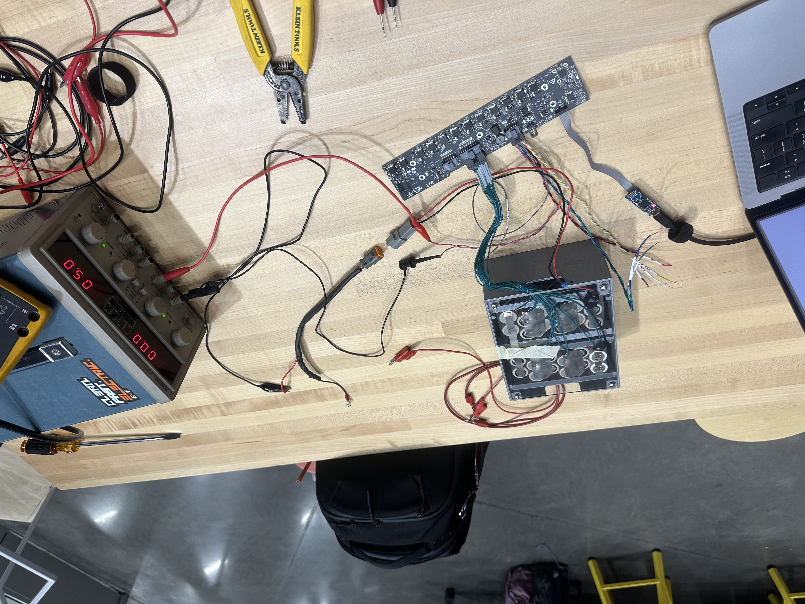
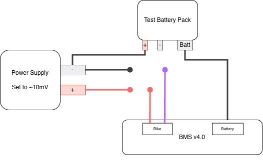

=========================
Test setup for BMS v4.0
=========================
This document will cover how to set up a test environment for the BMS v4.0.

Getting Started
===============
To get started, the settings for the BMS need to be transferred. Follow the steps outlined in :ref:`_transfer_over_uart`. This is a **very** important step and must be done **once** when a board is first brought up.

Loading BMS settings
--------------------
Once the settings have been transferred to the BMS, you must transfer them from the STM to the BQ chip. Since we do not freeze the settings on the BQ, we are required to flash the settings **every** time the board is turned on. This is often a source of errors, and settings transfers should always be redone if other errors appear on the BMS.

.. _flash_bms:
Flashing the BMS
================
The testing setup for the BMS uses the ``bq_interface`` target. This should be built, and flashed to the BMS. Flashing should be done using an ST-Link and STM32CubeProgrammer. This is the same `same process <https://sites.google.com/g.rit.edu/evt-home-page/firmware-team/getting-started/running-code>`_ as the rest of our boards.

UART Connection
---------------
UART on the BMS uses a baud rate of `115200`. When you first connect to the BMS after flashing ``bq_interface``, you may not have anything in your uart terminal. To fix this, just type h and hit enter to bring up the help menu.

Settings Transfer
-----------------
Before you can begin testing BMS functions, you need to transfer the settings. This can be done by entering `t` and waiting for all settings to transfer.

If there are any errors during settings transfer, unplug and replug the board, reflash ``bq_interface``, and try again. Errors in this section are caused by a flaw in BMS v4.0 that fails to hold the BQ reset line low. When the reset line is held high, it will shut down the BQ chip.

Testing
=======
You are now ready to start testing BMS functions! For each section, check the values that the BMS reports, then check the real-world value. After checking the real-world value, recheck that the BMS has not changed (just a sanity check).

Testing Voltages
----------------
Testing pack voltages is the first step in validating the BMS. First, plug the BMS into a test battery pack. You can then use ``v - Read voltages`` to list out the voltages for every cell.

*Note that on BMS v4.0, the BMS skips cells 8, 10, 12, and 14. Practically, this just requires you to adjust cell numbering after 8 when checking voltages.*

To double-check that the BMS is correctly reading voltages, grab a multimeter with two probes. The voltage of the first cell has a different measurement process than all other cells. This is because every cell is grounded to the previous cell. Since Cell #1 doesn't have a previous cell, you need to use the Batt - pad on the BMS as ground.

The diagram below shows the placement for the positive and negative probes from your multimeter.

.. image:: ./_static/images/cell_1_voltage_measurement.png
   :align: center

For every other cell (greater than 1), this diagram shows the positions of the positive and negative probes of the multimeter.

.. image:: ./_static/images/cell_voltage_measurement.png
   :align: center

Test pack balancing
-------------------
Checking pack balancing requires you to use a thermal imaging camera to check for heat waste coming off of the cell ICs.

To check cell balancing, use the ``B - Write balancing state`` command. Starting at cell 1, set the balancing state to 1. Point the thermal imaging camera at the cell you just enabled balancing for. If the cell begins to heat up, balancing is working! You should then write the balancing state to 0 and continue through the rest of the cells.

*Note that the BMS v4.0 cells after 8 are not numbered in order. Check "Testing Voltages" for an instruction on how to number cells.*

*Note 2, if you do not have a Thermal Imaging camera, you can place your finger on the IC and wait for it to get warm. BE CAREFUL as the IC gets VERY hot, so remove your finger right as it feels warm.*

Testing Polarity / Current: Paragraph Style
-------------------------------------------
Testing pack polarity requires a fairly intricate hardware setup to safely test. It is **VERY** important that you closely look at the following diagram & photo of the setup. The diagram will be used to explain the testing process; it is recommended that you use the photo as a reference for your physical setup. It is recommended that you talk to an electrical team member to get the entire setup right.

The following diagram will be used to explain the testing process; take a look at it now.

The first step to set up the power supply so it can provide a safe current to the BMS for testing:
1. Set the voltage on the power supply to ~10 mV.
2. Set the current limit on the power supply all the way down.

The second step is to connect the Battery Pack to the Power Supply. Be **very** careful here, as the battery packs run at a high voltage. To connect the two, connect the Positive line from the battery pack into the Negative line of the power supply.

The next step in testing polarity is to send a positive current through the BMS Current Shunt. This is done by connecting the *Positive Power Supply line (Red)* to the *Positive Bike Battery line (Red)*. Next, connect the *Negative Power Supply line (Gray)* to the *Negative Bike Battery Line (Purple)*. This creates a positive current flow through the BMS's current shunt.

It is now time to read the actual current that the BMS is reading. You should use the ``p - Read Current Shunt Polarity`` command to read the polarity across the shunt. This command should tell you that the polarity is **positive**. In a non-test setup, this would indicate that the battery pack is currently charging.

To test if discharging is being properly detected, you swap how the power supply is connected to the BMS. In this setup, you should connect the *Positive Power Supply line (Red)* to the *Negative Bike Battery Line (Purple)* and the *Negative Power Supply line (Gray)* to the *Positive Bike Battery line (Red)*. This creates a negative current flow through the BMS's current shunt.

Again, it is time to read the actual current that the BMS is reading. You should use the ``p - Read Current Shunt Polarity`` command to read the polarity across the shunt. This command should tell you that the polarity is **negative**. In a non-test setup, this would indicate that the battery pack is currently discharging.

Congrats! You have now tested the BMS current shunt. At this point, unplug the BMS from the power supply, then the battery pack from the power supply. You can then turn off the power supply and clean up!

Testing Polarity / Current: Bulleted Style
------------------------------------------
This diagram lays out the connection schema for the testing setup. Lines are colored to match the expected color of testing equipment that is available with the BMS v4.0.

Initial Circuit Setup:
1. Plug two negative leads into the Power Supply.
2. Plug one positive lead into the Power Supply.
3. Set the voltage on the power supply to ~10mV.
4. Set the current limit on the power supply all the way down.
5. Connect the BMS to the Test Battery Pack.
6. Connect one of the negative leads from the power supply to the positive line coming out of the test battery pack. You will need an unterminated male connector to do this (available with testing equipment).

Shunt Polarity Testing (Charging):
1. Connect the *Positive Power Supply line (Red)* to the *Positive Bike Battery line (Red)*.
2. Connect the *Negative Power Supply line (Gray)* to the *Negative Bike Battery Line (Purple)*.
3. Use the ``p - Read Current Shunt Polarity`` command.
4. Ensure that the polarity is **positive**

Shunt Polarity Testing (Discharging):
1. Connect the *Positive Power Supply line (Red)* to the *Negative Bike Battery Line (Purple)*.
2. Connect the *Negative Power Supply line (Gray)* to the *Positive Bike Battery line (Red)*.
3. Use the ``p - Read Current Shunt Polarity`` command.
4. Ensure that the polarity is **negative**
